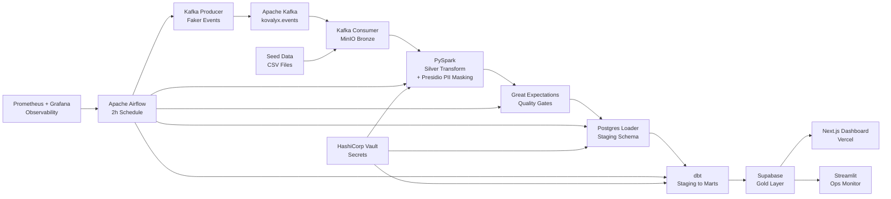

# Kovalyx

> Self-hosted, open-source real-time analytics pipeline for independent
> retailers — enterprise-grade insights without the enterprise price tag.

[](https://kovalyx.vercel.app)
[](https://github.com/zeciljain8197/Kovalyx/actions/workflows/ci.yml)
[](LICENSE)

## The Problem

Independent retailers generate real transaction data every day — POS
systems, inventory feeds, customer orders — but the tools that turn that
data into decisions (Snowflake, Databricks, Tableau, a dedicated data team)
are built and priced for companies two orders of magnitude bigger. A
five-location retail chain doesn't need a data warehouse that costs more
than its annual software budget; it needs to know which SKUs are about to
stock out and which customer cohorts are actually coming back.

So most independent retailers fly blind, stitching together spreadsheets
exported from three different SaaS tools, or they overpay for a BI stack
sized for a company they aren't. Kovalyx exists to close that gap: a
complete, real medallion-architecture pipeline — ingestion through
governed, PII-safe analytics marts — that runs on a single small VM and
costs nothing but the hosting bill.

## What Kovalyx Does

Kovalyx streams retail events end-to-end through a Bronze/Silver/Gold
medallion pipeline, masking PII before it ever reaches an analyst's screen,
and surfaces the result as live KPIs a store owner can actually read.

- **Real-time + batch ingestion** — Kafka-streamed live events and batch
  CSV drops land in an object-store Bronze layer together.
- **PII protection by construction** — every customer-identifying field is
  masked (Presidio NER + deterministic hashing) before Silver output ever
  exists, not as an afterthought at the reporting layer.
- **Data quality gates** — Great Expectations checkpoints block bad Silver
  output from ever reaching Gold.
- **One-command self-hosting** — the entire stack (Kafka, Spark, dbt,
  Airflow, Vault, Postgres, observability) runs from a single
  `docker compose up`.
- **A live KPI dashboard** — GMV, cohort retention, and inventory alerts,
  queryable directly from the governed Gold marts.

## Architecture



## Tech Stack

| Layer | Technologies |
|---|---|
| Ingestion (Bronze) | Apache Kafka 3.7, Python, Faker, MinIO |
| Transform (Silver) | PySpark 3.5, Microsoft Presidio, Great Expectations 0.18 |
| Gold | dbt-core 1.8, Supabase PostgreSQL, Kimball star schema |
| Orchestration | Apache Airflow 2.9 |
| Security | HashiCorp Vault 1.15, SASL/PLAIN Kafka auth, Postgres RLS |
| Observability | Prometheus, Grafana, Loki, Promtail |
| Frontend | Next.js 14, Vercel, shadcn/ui, Recharts |
| Infrastructure | Docker Compose, Nginx, Vercel, Supabase, GitHub Actions |

## Quick Start (Local)

### Prerequisites

- Docker + Docker Compose
- 8GB RAM minimum (Spark + Kafka + Airflow run concurrently)
- Git

### 3 commands to get running

```bash
git clone https://github.com/zeciljain8197/Kovalyx.git
cd kovalyx
cp .env.example .env   # fill in your values
./start.sh
```

`start.sh` brings up the full stack (`docker compose --profile full up -d`),
waits for Vault and Airflow to become healthy, and reseeds Vault's
dev-mode secrets — which are lost on every container restart, so this
step always runs, not just on first setup. Pass `--build` to rebuild
images first.

Prefer to drive it manually? `docker compose --profile full up -d`
brings up everything, including Nginx, the event producer/consumer, and
the frontend/ops-monitor containers. A bare `docker compose up -d` (no
profile) starts only the core infrastructure (Kafka, MinIO, Spark,
Postgres, Vault, Airflow, Prometheus/Grafana) — useful if you're driving
ingestion and dbt manually. Either way, Vault still needs a manual
`python scripts/vault_init.py --mode dev` after every restart if you skip
`start.sh`.

### Access

- Airflow UI: `http://localhost:8090/airflow`
- Grafana: `http://localhost:8090/grafana` (credentials from `.env`)
- MinIO console: `http://localhost:8090/minio`
- Pipeline monitor: `http://localhost:8090/pipeline-monitor`

(`8090` is Nginx's dev-mode HTTP listener — see `nginx/nginx.conf`. Individual
services are also reachable directly on their own mapped ports, e.g.
`localhost:8080` for Airflow, `localhost:3000` for Grafana.)

## Deployment

The full pipeline (Kafka, Spark, dbt, Airflow, Vault, Postgres,
observability) is designed to be run locally or self-hosted via
`docker compose --profile full up -d`, on any VM with 8GB+ RAM.

The public-facing piece — the `frontend/` dashboard — is deployed
separately and for free: Next.js on Vercel, reading live data from a
Supabase Postgres project that holds the Gold-layer marts. Vercel is
connected directly to this GitHub repo, so every push to `main` that
touches `frontend/` triggers an automatic rebuild and deploy — no
manual deploy step required.

## Security Design

- Every credential lives in HashiCorp Vault behind least-privilege AppRole
  policies — nothing is hardcoded in source.
- PII is masked at the Silver layer (Presidio + deterministic hashing)
  before it ever reaches Gold.
- Supabase Row Level Security scopes every Gold-layer role to exactly
  what it needs.
- Docker network isolation keeps Bronze/Silver/Gold services from talking
  to each other except where the pipeline actually requires it.

See [SECURITY.md](SECURITY.md) for the full policy and how to report a
vulnerability.

## Project Structure

```
kovalyx/
├── ingestion/        # Kafka producer/consumer, Bronze ingestion
├── spark/            # PySpark Silver transform + PII masking
├── quality/          # Great Expectations checkpoints
├── scripts/          # Seed data, Vault init, Silver->Postgres loader
├── dbt_project/       # Staging -> marts dbt models, snapshots, tests
├── airflow/           # DAG, Vault-AppRole plugin, orchestration image
├── vault/             # Vault server config
├── monitoring/         # Prometheus, Grafana, Loki, Promtail config
├── nginx/               # Reverse proxy config + TLS certs (git-ignored)
├── frontend/              # Next.js customer-facing dashboard
├── streamlit_monitor/       # Internal ops/audit dashboard
└── .github/                    # CI/CD workflows, issue templates
```

## Contributing

See [CONTRIBUTING.md](CONTRIBUTING.md) for local setup, the development
workflow, and required GitHub Secrets.

## License

MIT
